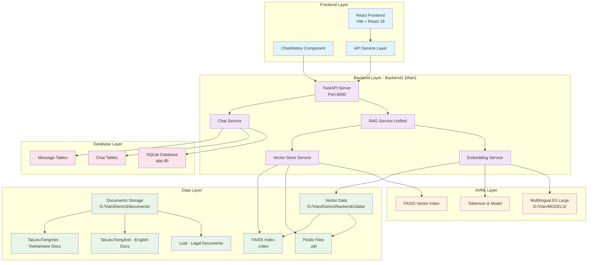

# 3.2. Thiết kế kiến trúc hệ thống

## 3.2.1. Tổng quan kiến trúc hệ thống

Hệ thống RAG (Retrieval-Augmented Generation) về an toàn thông tin được thiết kế theo mô hình kiến trúc phân lớp (layered architecture) với các thành phần chính: Frontend Layer, Backend Layer, AI/ML Layer, Data Layer và Database Layer. Kiến trúc này đảm bảo tính mở rộng, bảo trì và hiệu suất cao trong việc xử lý và trả lời các câu hỏi về an toàn thông tin.

## 3.2.2. Sơ đồ kiến trúc tổng quan



## 3.2.3. Mô tả chi tiết các lớp kiến trúc

### 3.2.3.1. Frontend Layer (Lớp Giao diện)

**Mục đích**: Cung cấp giao diện người dùng thân thiện để tương tác với hệ thống RAG.

**Thành phần chính**:
- **React Frontend**: Ứng dụng web được xây dựng bằng React 18 với Vite build tool
- **ChatHistory Component**: Component quản lý và hiển thị lịch sử trò chuyện
- **API Service Layer**: Lớp kết nối và giao tiếp với backend APIs

**Đặc điểm kỹ thuật**:
- Framework: React 18.2.0
- Build tool: Vite 7.1.2
- State management: React Hooks
- Styling: CSS modules

### 3.2.3.2. Backend Layer (Lớp Xử lý Backend)

**Mục đích**: Xử lý logic nghiệp vụ, quản lý dữ liệu và cung cấp API endpoints.

**Thành phần chính**:
- **FastAPI Server**: Server chính chạy trên port 8000, cung cấp REST API
- **RAG Service Unified**: Service thống nhất xử lý RAG với các tính năng:
  - Tìm kiếm chunks liên quan (Search relevant chunks)
  - Tạo câu trả lời toàn diện (Generate comprehensive answers)
  - Tạo tiêu đề và kết luận động (Dynamic title/conclusion generation)
  - Lọc theo danh mục (Category filtering: luat/english/vietnamese)
- **Embedding Service**: Xử lý embedding documents và chuyển đổi text thành vector
- **Vector Store Service**: Quản lý lưu trữ và tìm kiếm vector
- **Chat Service**: Quản lý cuộc trò chuyện và tin nhắn

**Đặc điểm kỹ thuật**:
- Framework: FastAPI
- Async/Await support
- CORS middleware
- SQLAlchemy ORM

### 3.2.3.3. AI/ML Layer (Lớp Trí tuệ Nhân tạo)

**Mục đích**: Cung cấp khả năng xử lý ngôn ngữ tự nhiên và tìm kiếm thông tin thông minh.

**Thành phần chính**:
- **Multilingual E5 Large**: Model embedding đa ngôn ngữ để chuyển đổi text thành vector
- **FAISS Vector Index**: Thư viện tìm kiếm vector nhanh của Facebook AI
- **Tokenizer & Model**: Xử lý tokenization và model inference

**Đặc điểm kỹ thuật**:
- Model: Microsoft multilingual-e5-large
- Vector search: FAISS
- Framework: PyTorch, Transformers
- Device: CUDA/CPU support

### 3.2.3.4. Data Layer (Lớp Dữ liệu)

**Mục đích**: Lưu trữ và quản lý tài liệu nguồn và dữ liệu vector.

**Thành phần chính**:

#### Documents Storage:
- **Luat**: Thư mục chứa tài liệu luật pháp Việt Nam về an toàn thông tin
- **TaiLieuTiengAnh**: Thư mục chứa tài liệu tiếng Anh về information security
- **TaiLieuTiengViet**: Thư mục chứa tài liệu tiếng Việt về an toàn thông tin

#### Vector Data:
- **Pickle Files**: Dữ liệu embeddings đã được serialize (.pkl)
- **FAISS Index**: Chỉ mục vector cho tìm kiếm nhanh (.index)

**Đặc điểm kỹ thuật**:
- Định dạng: PDF documents
- Vector format: NumPy arrays
- Serialization: Pickle protocol
- Index format: FAISS binary

### 3.2.3.5. Database Layer (Lớp Cơ sở Dữ liệu)

**Mục đích**: Lưu trữ thông tin cuộc trò chuyện và lịch sử tương tác.

**Thành phần chính**:
- **SQLite Database**: Cơ sở dữ liệu chính (app.db)
- **Chat Tables**: Bảng lưu trữ thông tin cuộc trò chuyện
- **Message Tables**: Bảng lưu trữ tin nhắn và phản hồi

**Đặc điểm kỹ thuật**:
- Database: SQLite
- ORM: SQLAlchemy
- Migration: Alembic

## 3.2.4. Luồng hoạt động của hệ thống

### 3.2.4.1. Quy trình khởi tạo Knowledge Base

1. **Xử lý tài liệu**: Script `init_knowledge_base_standalone.py` đọc và xử lý các tài liệu PDF
2. **Tạo embeddings**: Chuyển đổi text thành vector sử dụng Multilingual E5 Large model
3. **Xây dựng FAISS index**: Tạo chỉ mục vector để tìm kiếm nhanh
4. **Lưu trữ dữ liệu**: Lưu embeddings và index vào các file pickle và FAISS

### 3.2.4.2. Quy trình xử lý câu hỏi

1. **Nhận câu hỏi**: Frontend gửi câu hỏi qua API Service Layer
2. **Xử lý query**: Backend nhận query và gọi RAG Service Unified
3. **Tìm kiếm thông tin**: RAG Service tìm kiếm chunks liên quan trong vector database
4. **Tạo câu trả lời**: Generate comprehensive answer dựa trên kết quả tìm kiếm
5. **Trả về kết quả**: Gửi câu trả lời và nguồn tài liệu về Frontend
6. **Lưu trữ lịch sử**: Lưu cuộc trò chuyện vào SQLite database

### 3.2.4.3. Quy trình quản lý lịch sử chat

1. **Lưu trữ chat**: Mỗi cuộc trò chuyện được lưu vào Chat Tables
2. **Lưu trữ messages**: Tin nhắn và phản hồi được lưu vào Message Tables
3. **Hiển thị lịch sử**: ChatHistory component hiển thị danh sách cuộc trò chuyện
4. **Filter và search**: Hỗ trợ lọc theo danh mục và tìm kiếm

## 3.2.5. Công nghệ và thư viện sử dụng

### Frontend:
- React 18.2.0: Framework UI
- Vite 7.1.2: Build tool
- ESLint: Code linting

### Backend:
- FastAPI: Web framework
- SQLAlchemy: ORM
- Alembic: Database migration
- Uvicorn: ASGI server

### AI/ML:
- PyTorch: Deep learning framework
- Transformers: Hugging Face transformers library
- FAISS: Vector similarity search
- Sentence Transformers: Embedding models

### Data Processing:
- PyMuPDF (fitz): PDF processing
- NumPy: Numerical computing
- Pickle: Object serialization

## 3.2.6. Ưu điểm của kiến trúc

1. **Tính mở rộng**: Kiến trúc phân lớp cho phép mở rộng từng thành phần độc lập
2. **Tính bảo trì**: Tách biệt rõ ràng giữa các lớp, dễ dàng bảo trì và cập nhật
3. **Hiệu suất cao**: Sử dụng FAISS cho tìm kiếm vector nhanh
4. **Đa ngôn ngữ**: Hỗ trợ xử lý tài liệu tiếng Việt, tiếng Anh và luật pháp
5. **Khả năng tìm kiếm thông minh**: RAG approach kết hợp retrieval và generation
6. **Giao diện thân thiện**: React frontend cung cấp trải nghiệm người dùng tốt

## 3.2.7. Hướng dẫn triển khai

### Yêu cầu hệ thống:
- Python 3.8+
- Node.js 16+
- CUDA (khuyến nghị cho GPU acceleration)
- RAM: Tối thiểu 8GB, khuyến nghị 16GB+

### Các bước triển khai:

1. **Kích hoạt môi trường ảo**:
```bash
conda activate vian
```

2. **Khởi tạo Knowledge Base** (lần đầu tiên):
```bash
cd backend1
python init_knowledge_base_standalone.py
```

3. **Khởi chạy Backend**:
```bash
python main.py
```

4. **Khởi chạy Frontend**:
```bash
cd frontend1
npm run dev
```

Hệ thống sẽ chạy với Backend trên port 8000 và Frontend trên port 5173 (mặc định của Vite).
